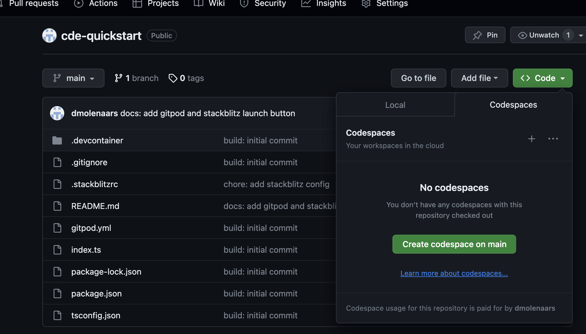

# Cloud Development Environment Quickstart
This repository aims to give an overview of the different Cloud Development Environment (CDE) vendors. You are encouraged to try them all out to see which one best suits your needs! Currently, only managed solutions are supported - self-hosted solutions like Hocus or Devpod will be added in the future.

Included in this project is a simple Express TypeScript application that listens on port 3000. In addition, a configuration file for every supported CDE has been added.

## Why use CDEs?

CDEs allow you to run your development environment inside of a container (also known as a development container) within the cloud.

The major benefit of development containers is that they allow us to reproduce identical development environments (for a complete introduction to development containers, see [here](https://clouddumpling.com/blog/2023-09-23-devcontainer-introduction/)) across teams.

This is achieved using configuration files such as `devcontainer.json`, `devfile.yml` or `gitpod.yml`. These configuration files allow us to add customization to our containers, such as utility and productivity tools.

While it is possible to run your container locally, the major benefit of CDEs is that they allow you to develop on machines that are much more powerful than your own device.

## Using Gitpod

## Using CodeSpaces
On the Github README page, click on the `Code` button, then select the `Codespaces` tab. You can now create a new codespace for the branch that you want to check out.

## Using StackBlitz

## Using CodeCatalyst
To get started in [CodeCatalyst](https://codecatalyst.aws/), you first need to set up a CodeCatalyst Space and a user account with sufficient access to the Space. See [here](https://docs.aws.amazon.com/codecatalyst/latest/userguide/setting-up-topnode.html) for more information on how to create a Space and a user.

After you have created a Space, you can make a Project in which the codebase will reside. First, make a fork of this repository. Then, select 'Create project' in the dashboard of the Space you have created. During project creation, select 'Start from scratch'. Finally, push the code of the forked repository to the CodeCatalyst registry.

You can now create a development environment by clicking on `Dev Environments`, which can be found under the `Code` section on the left of your dashboard.
